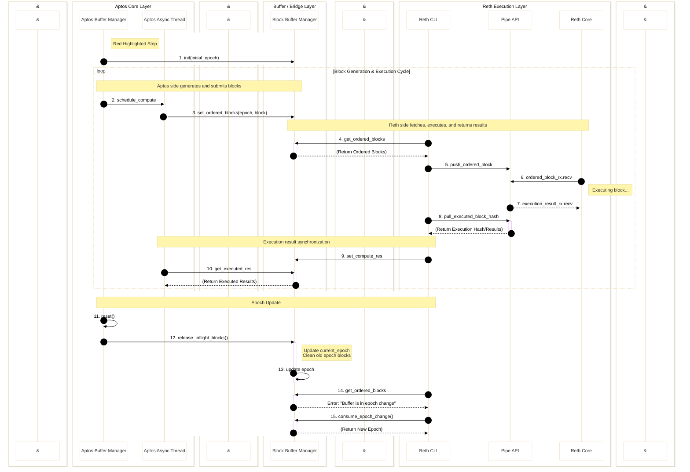

# Aptos-Reth Interaction Flow Documentation

This document provides a detailed description of the interaction flow between Aptos Core Layer, Buffer/Bridge Layer, and Reth Execution Layer, with a focus on the introduction and implementation details of the Epoch management mechanism. This document is based on actual code implementation and accurately reflects the system's design and working principles.

## Complete Interaction Sequence Diagram

The following sequence diagram illustrates the complete interaction flow between Aptos Core Layer, Buffer/Bridge Layer, and Reth Execution Layer, including initialization, block execution cycle, and Epoch update mechanism.



---

## 1. Overview

### 1.1 Background

In blockchain systems, Epoch is an important concept used to identify different phases in consensus protocols. In the Aptos blockchain, Epoch represents the update cycle of the validator set, where each Epoch has its unique validator configuration and consensus parameters.

### 1.2 Problem Statement

In the original design, the Epoch concept only existed in the Aptos Core Layer (consensus layer), and other modules (such as Block Buffer Manager and Reth CLI) could not perceive the existence of Epoch. This design led to a serious problem:

**Problem Scenario**: When Aptos undergoes an Epoch Change, different Epochs may have the same block number. For example:
- Block #100 in Epoch 1
- Block #100 in Epoch 2

Since Block Buffer Manager and Reth CLI only used `block_number` as a unique identifier, they could not distinguish between these two blocks belonging to different Epochs, which could lead to:
- Incorrect block execution order
- Confusion of execution results
- State inconsistency
- System failures

### 1.3 Solution

To solve this problem, we introduced Epoch variables in Block Buffer Manager and Reth CLI, using the **combination of `(epoch, block_number)`** to uniquely identify and locate blocks.

**Core Improvements**:
- Use composite key `BlockKey(epoch, block_number)` instead of single `block_number`
- Maintain `current_epoch` and `next_epoch` states in Block Buffer Manager
- Use `AtomicU64` in Reth CLI to maintain local `current_epoch`
- Implement complete Epoch lifecycle management mechanism, including detection, synchronization, and cleanup

**Advantages**:
- ✅ Uniqueness guarantee: Each block has a unique identifier
- ✅ Epoch transition safety: Correctly handle blocks across Epochs
- ✅ State consistency: Epoch states of all modules remain synchronized
- ✅ Backward compatibility: Does not affect existing execution flow logic

## 2. System Architecture

The system adopts a layered architecture design, consisting of **4 core modules** and **2 communication modules**, achieving decoupling between the consensus layer and execution layer.

### 2.1 Core Modules

#### Aptos Buffer Manager

**Responsibilities**:
- Manage the complete lifecycle state of Aptos Buffer
- Coordinate block execution phase, signing phase, and aggregation verification phase
- Submit blocks to the chain after verification is complete
- Handle state cleanup during Epoch transitions

**Key Features**:
- Block state management (Ordered, Executed, Signed, Aggregated)
- Asynchronous task scheduling (via `execution_schedule_phase_tx`)
- `reset()` operation during Epoch transitions

**Code Location**: `aptos-core/consensus/src/pipeline/buffer_manager.rs`

#### Block Buffer Manager

**Responsibilities**:
- Act as a bridge layer between Aptos Buffer Manager and Reth CLI
- Maintain Block List and execution state of each Block
- Manage Epoch state synchronization and transitions

**Design Characteristics**:
- This module can be independently separated as a standalone component in the future, achieving complete separation of consensus layer and computation layer
- Use `BlockKey(epoch, block_number)` as the unique identifier for blocks
- Provide thread-safe block state query and update interfaces
- Maintain both `current_epoch` and `next_epoch` states

**Data Structure**:
```rust
// Actual code structure
#[derive(Debug, Clone, Copy, PartialEq, Eq, Hash)]
pub struct BlockKey {
    pub epoch: u64,
    pub block_number: u64,
}

pub struct BlockStateMachine {
    blocks: HashMap<BlockKey, BlockState>,
    current_epoch: u64,
    next_epoch: Option<u64>,  // Used to temporarily store new epoch, updated in release_inflight_blocks
    // ...
}
```

**Code Location**: `crates/block-buffer-manager/src/block_buffer_manager.rs`

#### Reth CLI

**Responsibilities**:
- Manage the intermediate layer for interaction between external modules and execution layer
- Coordinate communication between Reth execution layer and other modules
- Maintain local Epoch state and synchronize with Block Buffer Manager's Epoch

**Key Features**:
- Poll pending blocks from Block Buffer Manager (using `expected_epoch` parameter)
- Communicate with Reth Core via Pipe API
- Synchronize execution results back to Block Buffer Manager (using current epoch)
- Detect Epoch changes and automatically synchronize (via error handling and `consume_epoch_change()`)

**Epoch Management**:
```rust
pub struct RethCli<EthApi: RethEthCall> {
    current_epoch: AtomicU64,  // Use atomic variable to ensure thread safety
    // ...
}
```

**Code Location**: `bin/gravity_node/src/reth_cli.rs`

#### Reth Core

**Responsibilities**:
- Core component of the execution layer, responsible for actually executing transactions in blocks
- Process transactions through EVM-compatible execution engine
- Return execution results and state changes (including possible new Epoch events)

### 2.2 Communication Modules

#### Aptos Async Thread

**Purpose**:
- Asynchronous thread on the Aptos side for asynchronously processing block computation tasks
- Avoid blocking the main consensus flow
- Improve system concurrency performance

**Use Cases**:
- Schedule block execution tasks (`schedule_compute`)
- Asynchronously fetch execution results (`get_executed_res`)
- Handle non-blocking I/O operations

#### Pipe API

**Purpose**:
- Communication channel between Reth CLI and Reth Core
- Use Rust channel mechanism for asynchronous message passing
- Support bidirectional communication (block push and result pull)

**Communication Patterns**:
- **Push Mode**: Reth CLI → Pipe API → Reth Core (block data)
- **Pull Mode**: Reth CLI ← Pipe API ← Reth Core (execution results)

## 3. Block Execution Flow

The Block execution flow is a complete cyclic process containing 9 steps, from block generation to execution result return, forming a closed loop.

### 3.1 Detailed Step Description

#### Phase 1: Block Generation and Submission (Steps 2-3)

1. **schedule_compute (Step 2)**
   - **Trigger**: Aptos Buffer Manager detects blocks that need to be executed
   - **Operation**: Schedule block computation tasks to Aptos Async Thread
   - **Implementation**: Send `ExecutionRequest` via `execution_schedule_phase_tx`
   - **Purpose**: Asynchronous processing without blocking the main flow

2. **set_ordered_blocks (Step 3)**
   - **Trigger**: Aptos Thread completes block preparation
   - **Operation**: Call `BlockBufferManager::set_ordered_blocks(parent_id, block)`
   - **Parameters**: `block` contains `block_meta.epoch` and `block_meta.block_number`
   - **Validation**: Check if the block's epoch matches `current_epoch`
     - If `block.epoch < current_epoch`: Ignore blocks from old epoch
     - If `block.epoch > current_epoch`: Ignore blocks from future epoch
     - If `block.epoch == current_epoch`: Process normally
   - **Storage**: Use `BlockKey::new(epoch, block_number)` as the key for storage
   - **State**: Block state is marked as `BlockState::Ordered`

#### Phase 2: Block Fetching and Execution (Steps 4-7)

3. **get_ordered_blocks (Step 4)**
   - **Trigger**: Reth CLI polls in `start_execution()` loop
   - **Parameters**: `get_ordered_blocks(start_num, max_size, expected_epoch)`
   - **Validation**: First check if `expected_epoch` matches `current_epoch`
     - If not matching, return error: `"Epoch mismatch: expected {} but current is {}"`
   - **Query**: Use `BlockKey::new(expected_epoch, block_number)` to query
   - **Return**: Return `Vec<(ExternalBlock, BlockId)>` containing blocks to be executed
   - **Key Improvement**: Changed from single `block_number` to `(epoch, block_number)` composite query

4. **push_ordered_block (Step 5)**
   - **Trigger**: Reth CLI obtains blocks to be executed
   - **Operation**: Push blocks to Reth Core via Pipe API
   - **Data**: Contains block's epoch information (`block.block_meta.epoch`)
   - **Purpose**: Pass block data to the execution layer

5. **ordered_block_rx.recv (Step 6)**
   - **Trigger**: Reth Core reads from Pipe API's receive channel
   - **Operation**: Reth Core receives blocks that need to be executed
   - **Execution**: Start executing transactions in the block
   - **State**: Block state in Block Buffer Manager remains `Ordered` (updated only after execution completes)

6. **execution_result_rx.recv (Step 7)**
   - **Trigger**: Reth Core completes block execution
   - **Operation**: Pipe API receives execution results
   - **Data**: Contains post-execution state root, gas consumption, logs, and possible `GravityEvent` (such as `NewEpoch` event)

#### Phase 3: Result Synchronization (Steps 8-10)

7. **pull_executed_block_hash (Step 8)**
   - **Trigger**: Reth CLI actively pulls in `start_commit_vote()` loop
   - **Operation**: Call `pipe_api.pull_executed_block_hash()`
   - **Data**: Returns `ExecutionResult` containing post-execution block hash and state information

8. **set_compute_res (Step 9)**
   - **Trigger**: Reth CLI obtains execution results
   - **Operation**: Call `BlockBufferManager::set_compute_res(block_id, block_hash, block_number, epoch, txn_status, events)`
   - **Parameters**: Use `self.current_epoch.load(Ordering::SeqCst)` as the epoch parameter
   - **Epoch Detection**: Inside `set_compute_res`, it calls `calculate_new_epoch_state()` to detect `NewEpoch` events in execution results
     - If a new epoch is detected, it sets `next_epoch = Some(new_epoch)`
   - **State Update**: Block state changes from `Ordered` to `Computed`
   - **Storage**: Results are stored associated with `BlockKey(epoch, block_number)`

9. **get_executed_res (Step 10)**
   - **Trigger**: Aptos Thread queries execution results
   - **Operation**: Call `BlockBufferManager::get_executed_res(block_id, block_num, epoch)`
   - **Query**: Use `BlockKey::new(epoch, block_num)` to query
   - **Return**: Return `StateComputeResult`
   - **Usage**: Aptos uses the results for subsequent signing and verification processes

### 3.2 Key Improvements

**Before**:
```rust
// Only use block_number
fn get_ordered_blocks(block_number: u64) -> Option<Block>
```

**After**:
```rust
// Use (epoch, block_number) combination
pub async fn get_ordered_blocks(
    &self,
    start_num: u64,
    max_size: Option<usize>,
    expected_epoch: u64,  // New parameter
) -> Result<Vec<(ExternalBlock, BlockId)>, anyhow::Error>
```

**Actual Implementation**:
```rust
// BlockKey structure
#[derive(Debug, Clone, Copy, PartialEq, Eq, Hash)]
pub struct BlockKey {
    pub epoch: u64,
    pub block_number: u64,
}

// Use BlockKey as HashMap key
let block_key = BlockKey::new(epoch, block_number);
block_state_machine.blocks.get(&block_key)
```

**Advantages**:
- ✅ Uniqueness: Each block has a unique identifier
- ✅ Safety: Avoid confusion of blocks across Epochs
- ✅ Traceability: Can precisely locate any historical block
- ✅ Type safety: Use struct instead of tuple, providing better type checking

### 3.3 Execution Flow Characteristics

- **Asynchronous Processing**: Use asynchronous threads and channels to improve concurrency performance
- **State Management**: Each block has clear state transitions (Ordered → Computed → Committed)
- **Error Handling**: When execution fails, state will roll back without affecting other blocks
- **Idempotency**: The same `(epoch, block_number)` query always returns the same result
- **Epoch Validation**: Epoch validation is performed at each critical step to ensure consistency

## 4. Epoch Update Mechanism

The Epoch update mechanism is a key component of the system, ensuring consistency and correctness of system state during Epoch transitions. The implementation adopts a **two-phase update** strategy: first detect and temporarily store the new epoch, then formally update it when cleaning up old blocks.

### 4.1 Initialization Phase

#### init (Step 1)

**Trigger Timing**:
- When the node starts
- After system initialization is complete, before starting to process blocks

**Operation Flow**:
1. Aptos Core Layer obtains the current Epoch value
2. Call `BlockBufferManager::init(latest_commit_block_number, block_number_to_block_id_with_epoch, initial_epoch)`
3. Block Buffer Manager initializes internal state:
   - Set `current_epoch = initial_epoch`
   - Initialize `next_epoch = None`
   - Set `buffer_state = Ready`
4. Reth CLI initializes in `start_execution()`:
   - Call `get_block_buffer_manager().get_current_epoch().await`
   - Set `self.current_epoch.store(buffer_epoch, Ordering::SeqCst)`

**Implementation Code**:
```rust
// Block Buffer Manager
pub async fn init(
    &self,
    latest_commit_block_number: u64,
    block_number_to_block_id_with_epoch: HashMap<u64, (u64, BlockId)>,
    initial_epoch: u64,  // Obtained from Aptos
) {
    block_state_machine.current_epoch = initial_epoch;
    // ...
}

// Reth CLI
let buffer_epoch = get_block_buffer_manager().get_current_epoch().await;
self.current_epoch.store(buffer_epoch, Ordering::SeqCst);
```

**Implementation Points**:
- Must be completed before using Block Buffer Manager
- Epoch value must be obtained from Aptos consensus layer to ensure consistency
- Reth CLI needs to actively synchronize Block Buffer Manager's epoch

### 4.2 Epoch Transition Phase

When Aptos undergoes an Epoch Change, the system needs to perform a series of cleanup and synchronization operations. The implementation adopts a **two-phase update**:

1. **Detection Phase**: Detect `NewEpoch` events in execution results, temporarily store in `next_epoch`
2. **Update Phase**: Formally update `current_epoch` in `release_inflight_blocks()`

#### New Epoch Detection (in set_compute_res)

**Trigger Timing**:
- When processing execution results in `set_compute_res()`
- Execution results contain `GravityEvent::NewEpoch` event

**Operation Flow**:
1. `set_compute_res()` calls `calculate_new_epoch_state(events, block_num)`
2. Find `NewEpoch` event from events
3. Parse new epoch and validator set
4. Set `next_epoch = Some(new_epoch)` (**do not immediately update current_epoch**)
5. Record `latest_epoch_change_block_number = block_num`

**Implementation Code**:
```rust
async fn calculate_new_epoch_state(
    &self,
    events: &Vec<GravityEvent>,
    block_num: u64,
    block_state_machine: &mut BlockStateMachine,
) -> Result<Option<EpochState>, anyhow::Error> {
    // Find NewEpoch event
    let new_epoch_event = events.iter().find(|event| {
        matches!(event, GravityEvent::NewEpoch(_, _))
    });
    
    if let Some(GravityEvent::NewEpoch(new_epoch, bytes)) = new_epoch_event {
        // Temporarily store in next_epoch, do not immediately update current_epoch
        block_state_machine.next_epoch = Some(*new_epoch);
        *self.latest_epoch_change_block_number.lock().await = block_num;
        // ...
    }
}
```

#### reset (Step 11)

**Trigger Timing**:
- Aptos Buffer Manager detects Epoch Change event
- Before switching to new Epoch

**Operation Content**:
- Clear internal buffer: `self.buffer = Buffer::new()`
- Reset execution and signing roots: `self.execution_root = None; self.signing_root = None`
- Clear pending block queue
- Call `get_block_buffer_manager().release_inflight_blocks().await`

**Implementation Code**:
```rust
async fn reset(&mut self) {
    self.buffer = Buffer::new();
    self.execution_root = None;
    self.signing_root = None;
    // Clear queue
    while let Ok(Some(_)) = self.block_rx.try_next() {}
    // Wait for ongoing tasks to complete
    get_block_buffer_manager().release_inflight_blocks().await;
    while self.ongoing_tasks.load(Ordering::SeqCst) > 0 {
        tokio::time::sleep(Duration::from_millis(10)).await;
    }
}
```

#### release_inflight_blocks (Step 12)

**Trigger Timing**:
- Called in `reset()`
- Block Buffer Manager receives cleanup request

**Operation Content**:
1. **Update Epoch**: Update `current_epoch` from `next_epoch`
   ```rust
   if let Some(next_epoch) = block_state_machine.next_epoch.take() {
       block_state_machine.current_epoch = next_epoch;
   }
   ```
2. **Clean Old Blocks**: Retain blocks with `block_number <= latest_epoch_change_block_number`
   ```rust
   block_state_machine.blocks.retain(|key, _| {
       key.block_number <= latest_epoch_change_block_number
   });
   ```
3. **Set State**: `buffer_state = EpochChange`

**Implementation Code**:
```rust
pub async fn release_inflight_blocks(&self) {
    let mut block_state_machine = self.block_state_machine.lock().await;
    let latest_epoch_change_block_number = 
        *self.latest_epoch_change_block_number.lock().await;
    let old_epoch = block_state_machine.current_epoch;
    
    // Update current_epoch from next_epoch
    if let Some(next_epoch) = block_state_machine.next_epoch.take() {
        block_state_machine.current_epoch = next_epoch;
        info!("release_inflight_blocks: updating current_epoch from {} to {}",
              old_epoch, next_epoch);
    }
    
    // Clean old epoch blocks
    block_state_machine.blocks.retain(|key, _| {
        key.block_number <= latest_epoch_change_block_number
    });
    
    self.buffer_state.store(BufferState::EpochChange as u8, Ordering::SeqCst);
    // ...
}
```

#### Reth CLI Epoch Synchronization (Steps 14-15)

**Trigger Timing**:
- Reth CLI detects error when calling `get_ordered_blocks()`: `"Buffer is in epoch change"`
- Or detects Epoch mismatch error

**Operation Flow**:
1. Detect epoch change error
2. Call `consume_epoch_change()` to get new epoch
3. Update local `current_epoch`
4. Reset `start_ordered_block` to `latest_epoch_change_block_number + 1`

**Implementation Code**:
```rust
// In start_execution() loop
let exec_blocks = get_block_buffer_manager()
    .get_ordered_blocks(start_ordered_block, None, current_epoch)
    .await;

if let Err(e) = exec_blocks {
    if e.to_string().contains("Buffer is in epoch change") {
        // Get new epoch
        let new_epoch = get_block_buffer_manager()
            .consume_epoch_change()
            .await;
        let latest_epoch_change_block_number = 
            get_block_buffer_manager()
            .latest_epoch_change_block_number()
            .await;
        
        // Update local epoch
        let old_epoch = self.current_epoch.swap(new_epoch, Ordering::SeqCst);
        
        // Reset starting block number
        start_ordered_block = latest_epoch_change_block_number + 1;
        
        warn!("Buffer is in epoch change, reset start_ordered_block from {} to {}, epoch from {} to {}",
              from, start_ordered_block, old_epoch, new_epoch);
    }
}
```

### 4.3 Epoch Synchronization Strategy

**Passive Synchronization (Primary Mechanism)**:
- Reth CLI passes `expected_epoch` in each `get_ordered_blocks()` call
- Block Buffer Manager validates `expected_epoch == current_epoch`
- If not matching, return clear error message
- Reth CLI actively calls `consume_epoch_change()` to synchronize after detecting error

**State Machine Design**:
- `BufferState::Uninitialized`: Not initialized
- `BufferState::Ready`: Normal state
- `BufferState::EpochChange`: Epoch transition in progress (at this time `get_ordered_blocks` will return error)

**Synchronization Timing**:
- Automatically checked on each `get_ordered_blocks` call
- Error handling mechanism ensures timely synchronization
- No additional polling mechanism needed

### 4.4 Design Points

The Epoch update mechanism ensures that during Epoch transitions:

1. **Two-Phase Update**
   - Detection phase: Detect new epoch in execution results, temporarily store in `next_epoch`
   - Update phase: Formally update `current_epoch` when cleaning up old blocks
   - Avoids state inconsistency that may occur when immediately updating upon detecting new epoch

2. **State Consistency**
   - Epoch states of all modules remain synchronized
   - Use `AtomicU64` and `Mutex` to ensure thread safety
   - Ensure synchronization success through error handling and retry mechanisms

3. **Resource Cleanup**
   - Incomplete blocks from old Epoch can be correctly cleaned up
   - Only retain blocks up to and including the epoch change block
   - Prevent memory leaks and resource waste

4. **Correctness Guarantee**
   - New Epoch can be synchronized to all related modules in time
   - System state maintains consistency and correctness
   - Prevent using wrong epoch through validation mechanisms

5. **Fault Recovery**
   - If Epoch synchronization fails, the system can detect and handle it
   - Provide retry mechanisms and error logging
   - Ensure process correctness through state machine management

## 5. Implementation Details

### 5.1 Data Structures

#### BlockKey

```rust
#[derive(Debug, Clone, Copy, PartialEq, Eq, Hash)]
pub struct BlockKey {
    pub epoch: u64,
    pub block_number: u64,
}

impl BlockKey {
    pub fn new(epoch: u64, block_number: u64) -> Self {
        Self { epoch, block_number }
    }
}
```

#### BlockState

```rust
#[derive(Debug)]
pub enum BlockState {
    Ordered {
        block: ExternalBlock,
        parent_id: BlockId,
    },
    Computed {
        id: BlockId,
        compute_result: StateComputeResult,
    },
    Committed {
        hash: Option<[u8; 32]>,
        compute_result: StateComputeResult,
        id: BlockId,
        persist_notifier: Option<Sender<()>>,
    },
}
```

### 5.2 Thread Safety

All operations involving Epoch and block state must be thread-safe:

- **Block Buffer Manager**: Use `Arc<Mutex<BlockStateMachine>>` to protect shared state
- **Reth CLI**: Use `AtomicU64` to store `current_epoch`, supporting concurrent reads
- **State Queries**: All query operations are performed under lock protection

### 5.3 Error Handling

- **Epoch Mismatch**: Return clear error message, trigger synchronization flow
  ```rust
  if expected_epoch != current_epoch {
      return Err(anyhow::anyhow!(
          "Epoch mismatch: expected {} but current is {}",
          expected_epoch, current_epoch
      ));
  }
  ```
- **Epoch Change State**: Return special error, prompting to call `consume_epoch_change()`
  ```rust
  if self.is_epoch_change() {
      return Err(anyhow::anyhow!("Buffer is in epoch change"));
  }
  ```
- **Block Not Found**: Distinguish between "not exists" and "not ready" cases, use waiting mechanism

### 5.4 Performance Optimization

- **Batch Queries**: `get_ordered_blocks()` supports querying multiple consecutive blocks at once
- **Asynchronous Processing**: Use asynchronous I/O and channels to improve throughput
- **State Caching**: Use HashMap for fast lookup, O(1) time complexity
- **Resource Cleanup**: Periodically clean up committed blocks to prevent memory growth

### 5.5 Monitoring and Logging

- Record all Epoch transition events and key operations
- Monitor Epoch synchronization latency and error rates
- Statistics on block execution success and failure rates
- Record exceptional situations for troubleshooting

## 6. Code Reference

### 6.1 Key Files

- **Aptos Buffer Manager**: `aptos-core/consensus/src/pipeline/buffer_manager.rs`
- **Block Buffer Manager**: `crates/block-buffer-manager/src/block_buffer_manager.rs`
- **Reth CLI**: `bin/gravity_node/src/reth_cli.rs`

### 6.2 Key Interfaces

#### Block Buffer Manager

```rust
// Initialization
pub async fn init(
    &self,
    latest_commit_block_number: u64,
    block_number_to_block_id_with_epoch: HashMap<u64, (u64, BlockId)>,
    initial_epoch: u64,
)

// Set ordered blocks
pub async fn set_ordered_blocks(
    &self,
    parent_id: BlockId,
    block: ExternalBlock,
) -> Result<(), anyhow::Error>

// Get ordered blocks (requires expected_epoch)
pub async fn get_ordered_blocks(
    &self,
    start_num: u64,
    max_size: Option<usize>,
    expected_epoch: u64,  // Key parameter
) -> Result<Vec<(ExternalBlock, BlockId)>, anyhow::Error>

// Set compute result (includes epoch parameter)
pub async fn set_compute_res(
    &self,
    block_id: BlockId,
    block_hash: [u8; 32],
    block_num: u64,
    epoch: u64,  // Key parameter
    txn_status: Arc<Option<Vec<TxnStatus>>>,
    events: Vec<GravityEvent>,
) -> Result<(), anyhow::Error>

// Get executed result (includes epoch parameter)
pub async fn get_executed_res(
    &self,
    block_id: BlockId,
    block_num: u64,
    epoch: u64,  // Key parameter
) -> Result<StateComputeResult, anyhow::Error>

// Release in-flight blocks (update epoch)
pub async fn release_inflight_blocks(&self)

// Get current epoch
pub async fn get_current_epoch(&self) -> u64

// Consume epoch change (returns new epoch)
pub async fn consume_epoch_change(&self) -> u64
```

#### Reth CLI

```rust
// Start execution loop
pub async fn start_execution(&self) -> Result<(), String> {
    // Initialize epoch
    let buffer_epoch = get_block_buffer_manager().get_current_epoch().await;
    self.current_epoch.store(buffer_epoch, Ordering::SeqCst);
    
    loop {
        let current_epoch = self.current_epoch.load(Ordering::SeqCst);
        // Use current_epoch to query
        let exec_blocks = get_block_buffer_manager()
            .get_ordered_blocks(start_ordered_block, None, current_epoch)
            .await;
        
        // Handle epoch change
        if let Err(e) = exec_blocks {
            if e.to_string().contains("Buffer is in epoch change") {
                let new_epoch = get_block_buffer_manager()
                    .consume_epoch_change()
                    .await;
                self.current_epoch.swap(new_epoch, Ordering::SeqCst);
            }
        }
        // ...
    }
}
```

## Contributing

If you have any questions or suggestions, please feel free to submit an Issue or Pull Request.
