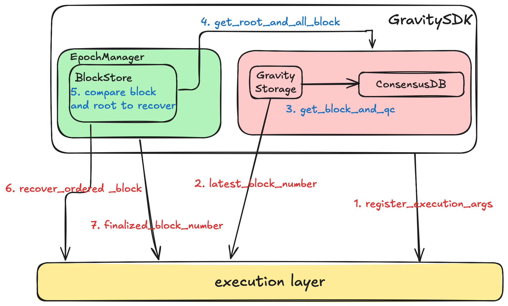
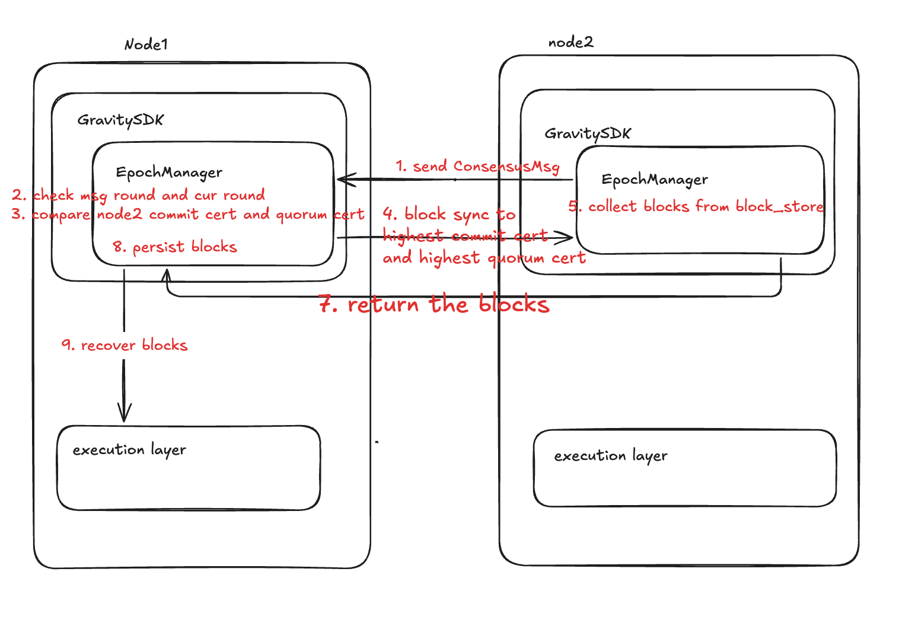

# GravitySDK Recovery API

## Overview

GravitySDK provides Recovery API:

```rust
#[async_trait]
pub trait RecoveryApi: Send + Sync {
    async fn register_execution_args(&self, args: ExecutionArgs);

    async fn latest_block_number(&self) -> u64;

    async fn finalized_block_number(&self) -> u64;

    async fn recover_ordered_block(&self, parent_id: BlockId, block: ExternalBlock) -> Result<(), ExecError>;
}
```

The recovery of GravityChain mainly consists of three parts:

1. Self-recovery of execution layer
2. Replay of consensus layer blocks
3. Block height synchronization between nodes

The self-recovery of execution layer is guaranteed by the execution layer itself. GravitySDK Recovery provides the functionality for the latter two. When recovery starts, the node first obtains the block height from the execution layer, then compares it with the current consensus block height, and replays the blocks missing from the execution layer (the difference between execution and consensus layers exists because blocks are stored separately and cannot be written atomically). After the consensus layer blocks are replayed, the node can communicate with other nodes. When receiving ConsensusMsg from other nodes during communication, if its own Round is less than other nodes' Round, it will initiate Block Sync to synchronize to the latest blocks.

## Core Concepts of Recovery

1. Execution Client replays and recovers local blocks
2. Consensus Client replays and recovers local Batches
3. Recover from network through Block Sync or State Sync

The principles for each module are:

1. If local data exists, try to recover to the highest block number, though allowing idempotent storage that won't cause dirty reads in subsequent phases
2. If receiving transactions or blocks from different modules of the same entity, they can be considered trusted and generally don't need verification, such as transactions with user signatures, blocks with 2f+1 votes, etc.
3. If transmitted from other entities in the network, verification must be guaranteed, such as multi-signature verification for blocks and hash verification for State

## Recovery Interface

```rust
#[async_trait]
pub trait RecoveryApi: Send + Sync {
    async fn latest_block_number(&self) -> u64;

    async fn recover_ordered_block(&self, parent_id: BlockId, block: ExternalBlock) -> Result<(), ExecError>;
    
    async fn register_execution_args(&self, args: ExecutionArgs);

    async fn finalized_block_number(&self) -> u64;
}
```

- latest_block_number: Get the execution layer block height when starting recovery
- recover_ordered_block: Replay consensus layer blocks to execution layer
- register_execution_args: Collect consensus layer data and send to execution layer during startup
- finalized_block_number: Get the persisted block height from execution layer

## Recovery Implementation

https://app.excalidraw.com/o/6fsbDfhmBdG/2q3DZGqSqQd

- Consensus Layer Recovery Flow Chart



1. Get execution layer block height via latest_block_number
    - RecoveryApi::latest_block_number: Get latest block height from execution layer
2. Get all Blocks and QCs from ConsensusDB
    - ConsensusDB::get_data: Return all Blocks and QCs from consensus layer DB
3. Use latest_block_number to locate corresponding Block as Root
    - RecoveryData::find_root_by_block_number: Find Block corresponding to latest_block_number as Root
4. Compare Root with blocks that have reached QC
    - BlockStore::recover_blocks: Compare QC rounds with root round: qc.commit_info().round() > root.round()
5. Replay blocks whose QC Round is greater than Root Round
    - RecoveryApi::recover_ordered_block: Recover blocks to execution layer

## Multi-node Block Sync Flow Chart



1. Node1 receives ConsensusMsg request from Node2
2. Node1 compares Msg Round with current Round
    - RoundManager::ensure_round_and_sync_up: Compare msg round with current node round, execute sync_up if current round is smaller
3. Node1 compares highest commit cert and highest quorum cert from Msg
4. Node1 initiates Block Sync request to Node2 to sync to latest highest quorum cert
    - BlockStore::add_certs
        - sync_to_highest_commit_cert: Sync to highest commit cert
        - sync_to_highest_quorum_cert: Sync to highest quorum cert
        - fast_forward_sync: Send request to other nodes
5. Node2 collects corresponding blocks and LedgerInfo and returns to Node1
    - BlockStore::process_block_retrieval: Collect and return blocks and LedgerInfo needed by node1
6. Node1 persists received data and initiates consensus layer recovery process

## Future Improvements

1. Currently only supports Block Sync for node synchronization, which may cause issues with large data volumes for nodes that fall far behind, leading to continuous sync or resource-constrained sync failures. State Sync needs to be implemented to quickly sync latest state/block height.
2. Currently only supports Round-level Sync. When node changes are detected, the node's Epoch will be modified, but cross-Epoch synchronization is not yet supported.