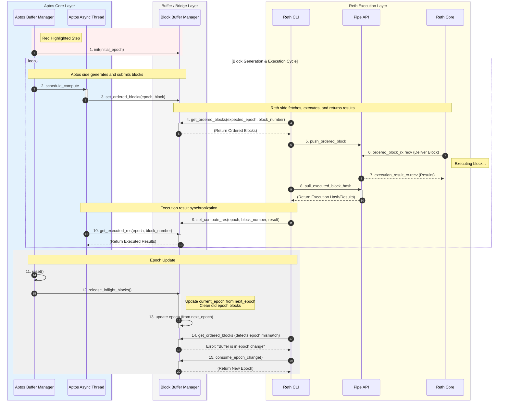

# Aptos-Reth 交互流程文档

本文档详细描述了 Aptos Core Layer、Buffer/Bridge Layer 和 Reth Execution Layer 之间的交互流程，重点说明了 Epoch 管理机制的引入和实现细节。本文档基于实际代码实现，准确反映了系统的设计和工作原理。

## 完整交互序列图

下面的序列图展示了 Aptos Core Layer、Buffer/Bridge Layer 和 Reth Execution Layer 之间的完整交互流程，包括初始化、区块执行循环和 Epoch 更新机制。



---

## 1. 概述

### 1.1 背景

在区块链系统中，Epoch（纪元）是一个重要的概念，用于标识共识协议中的不同阶段。在 Aptos 区块链中，Epoch 代表了验证者集合的更新周期，每个 Epoch 都有其独特的验证者配置和共识参数。

### 1.2 问题背景

在原有设计中，Epoch 概念仅存在于 Aptos Core Layer（共识层），其他模块（如 Block Buffer Manager 和 Reth CLI）无法感知 Epoch 的存在。这种设计导致了一个严重的问题：

**问题场景**：当 Aptos 发生 Epoch Change 时，不同 Epoch 中可能存在相同的 block number。例如：
- Epoch 1 的 Block #100
- Epoch 2 的 Block #100

由于 Block Buffer Manager 和 Reth CLI 仅使用 `block_number` 作为唯一标识，它们无法区分这两个属于不同 Epoch 的区块，可能导致：
- 区块执行顺序错误
- 执行结果混淆
- 状态不一致
- 系统故障

### 1.3 解决方案

为了解决这个问题，我们在 Block Buffer Manager 和 Reth CLI 中引入了 Epoch 变量，通过 **`(epoch, block_number)` 的组合**来唯一标识和定位区块。

**核心改进**：
- 使用复合键 `BlockKey(epoch, block_number)` 替代单一 `block_number`
- 在 Block Buffer Manager 中维护 `current_epoch` 和 `next_epoch` 状态
- 在 Reth CLI 中使用 `AtomicU64` 维护本地 `current_epoch`
- 实现完整的 Epoch 生命周期管理机制，包括检测、同步和清理

**优势**：
- ✅ 唯一性保证：每个区块都有唯一的标识符
- ✅ Epoch 切换安全：正确处理跨 Epoch 的区块
- ✅ 状态一致性：所有模块的 Epoch 状态保持同步
- ✅ 向后兼容：不影响现有的执行流程逻辑

## 2. 系统架构

系统采用分层架构设计，由 **4 个核心模块** 和 **2 个通信模块** 组成，实现了共识层与执行层的解耦。

### 2.1 核心模块

#### Aptos Buffer Manager

**职责**：
- 管理 Aptos Buffer 的完整生命周期状态
- 协调区块的执行阶段、签名阶段、聚合验证阶段
- 在验证完成后提交区块到链上
- 处理 Epoch 切换时的状态清理

**关键功能**：
- 区块状态管理（Ordered、Executed、Signed、Aggregated）
- 异步任务调度（通过 `execution_schedule_phase_tx`）
- Epoch 切换时的 `reset()` 操作

**代码位置**：`aptos-core/consensus/src/pipeline/buffer_manager.rs`

#### Block Buffer Manager

**职责**：
- 作为 Aptos Buffer Manager 和 Reth CLI 之间的桥梁层
- 维护 Block List 以及每个 Block 的执行状态
- 管理 Epoch 状态同步和切换

**设计特点**：
- 该模块未来可以独立为单独组件，实现共识层和计算层的完全分离
- 使用 `BlockKey(epoch, block_number)` 作为区块的唯一标识
- 提供线程安全的区块状态查询和更新接口
- 维护 `current_epoch` 和 `next_epoch` 两个状态

**数据结构**：
```rust
// 实际代码结构
#[derive(Debug, Clone, Copy, PartialEq, Eq, Hash)]
pub struct BlockKey {
    pub epoch: u64,
    pub block_number: u64,
}

pub struct BlockStateMachine {
    blocks: HashMap<BlockKey, BlockState>,
    current_epoch: u64,
    next_epoch: Option<u64>,  // 用于暂存新 epoch，在 release_inflight_blocks 时更新
    // ...
}
```

**代码位置**：`crates/block-buffer-manager/src/block_buffer_manager.rs`

#### Reth CLI

**职责**：
- 管理外部模块与执行层交互的中间层
- 协调 Reth 执行层与其他模块的通信
- 维护本地 Epoch 状态并同步 Block Buffer Manager 的 Epoch

**关键功能**：
- 从 Block Buffer Manager 轮询待执行区块（使用 `expected_epoch` 参数）
- 通过 Pipe API 与 Reth Core 通信
- 同步执行结果回 Block Buffer Manager（使用当前 epoch）
- 检测 Epoch 变更并自动同步（通过错误处理和 `consume_epoch_change()`）

**Epoch 管理**：
```rust
pub struct RethCli<EthApi: RethEthCall> {
    current_epoch: AtomicU64,  // 使用原子变量保证线程安全
    // ...
}
```

**代码位置**：`bin/gravity_node/src/reth_cli.rs`

#### Reth Core

**职责**：
- 执行层核心组件，负责实际执行区块中的交易
- 通过 EVM 兼容的执行引擎处理交易
- 返回执行结果和状态变更（包括可能的新 Epoch 事件）

### 2.2 通信模块

#### Aptos Async Thread

**作用**：
- Aptos 端的异步线程，用于异步处理区块计算任务
- 避免阻塞主共识流程
- 提高系统并发性能

**使用场景**：
- 调度区块执行任务（`schedule_compute`）
- 异步获取执行结果（`get_executed_res`）
- 处理非阻塞的 I/O 操作

#### Pipe API

**作用**：
- Reth CLI 和 Reth Core 之间的通信通道
- 使用 Rust channel 机制实现异步消息传递
- 支持双向通信（区块推送和结果拉取）

**通信模式**：
- **推送模式**：Reth CLI → Pipe API → Reth Core（区块数据）
- **拉取模式**：Reth CLI ← Pipe API ← Reth Core（执行结果）

## 3. Block 执行流程

Block 执行流程是一个完整的循环过程，包含 9 个步骤，从区块生成到执行结果返回，形成一个闭环。

### 3.1 详细步骤说明

#### 阶段 1：区块生成与提交（步骤 2-3）

1. **schedule_compute（步骤 2）**
   - **触发**：Aptos Buffer Manager 检测到需要执行的区块
   - **操作**：将区块计算任务调度到 Aptos Async Thread
   - **实现**：通过 `execution_schedule_phase_tx` 发送 `ExecutionRequest`
   - **目的**：异步处理，不阻塞主流程

2. **set_ordered_blocks（步骤 3）**
   - **触发**：Aptos Thread 完成区块准备
   - **操作**：调用 `BlockBufferManager::set_ordered_blocks(parent_id, block)`
   - **参数**：`block` 包含 `block_meta.epoch` 和 `block_meta.block_number`
   - **验证**：检查区块的 epoch 是否与 `current_epoch` 匹配
     - 如果 `block.epoch < current_epoch`：忽略旧 epoch 的区块
     - 如果 `block.epoch > current_epoch`：忽略未来 epoch 的区块
     - 如果 `block.epoch == current_epoch`：正常处理
   - **存储**：使用 `BlockKey::new(epoch, block_number)` 作为键存储
   - **状态**：区块状态标记为 `BlockState::Ordered`

#### 阶段 2：区块获取与执行（步骤 4-7）

3. **get_ordered_blocks（步骤 4）**
   - **触发**：Reth CLI 在 `start_execution()` 循环中轮询
   - **参数**：`get_ordered_blocks(start_num, max_size, expected_epoch)`
   - **验证**：首先检查 `expected_epoch` 是否与 `current_epoch` 匹配
     - 如果不匹配，返回错误：`"Epoch mismatch: expected {} but current is {}"`
   - **查询**：使用 `BlockKey::new(expected_epoch, block_number)` 查询
   - **返回**：返回 `Vec<(ExternalBlock, BlockId)>`，包含待执行的区块
   - **关键改进**：从单一 `block_number` 改为 `(epoch, block_number)` 组合查询

4. **push_ordered_block（步骤 5）**
   - **触发**：Reth CLI 获取到待执行区块
   - **操作**：通过 Pipe API 将区块推送给 Reth Core
   - **数据**：包含区块的 epoch 信息（`block.block_meta.epoch`）
   - **目的**：将区块数据传递给执行层

5. **ordered_block_rx.recv（步骤 6）**
   - **触发**：Reth Core 从 Pipe API 的接收通道读取
   - **操作**：Reth Core 接收需要执行的区块
   - **执行**：开始执行区块中的交易
   - **状态**：区块状态在 Block Buffer Manager 中仍为 `Ordered`（执行完成后才更新）

6. **execution_result_rx.recv（步骤 7）**
   - **触发**：Reth Core 完成区块执行
   - **操作**：Pipe API 接收执行结果
   - **数据**：包含执行后的状态根、gas 消耗、日志、以及可能的 `GravityEvent`（如 `NewEpoch` 事件）

#### 阶段 3：结果同步（步骤 8-10）

7. **pull_executed_block_hash（步骤 8）**
   - **触发**：Reth CLI 在 `start_commit_vote()` 循环中主动拉取
   - **操作**：调用 `pipe_api.pull_executed_block_hash()`
   - **数据**：返回 `ExecutionResult`，包含执行后的区块哈希和状态信息

8. **set_compute_res（步骤 9）**
   - **触发**：Reth CLI 获得执行结果
   - **操作**：调用 `BlockBufferManager::set_compute_res(block_id, block_hash, block_number, epoch, txn_status, events)`
   - **参数**：使用 `self.current_epoch.load(Ordering::SeqCst)` 作为 epoch 参数
   - **Epoch 检测**：在 `set_compute_res` 内部，会调用 `calculate_new_epoch_state()` 检测执行结果中的 `NewEpoch` 事件
     - 如果检测到新 epoch，会设置 `next_epoch = Some(new_epoch)`
   - **状态更新**：区块状态从 `Ordered` 更新为 `Computed`
   - **存储**：结果与 `BlockKey(epoch, block_number)` 关联存储

9. **get_executed_res（步骤 10）**
   - **触发**：Aptos Thread 查询执行结果
   - **操作**：调用 `BlockBufferManager::get_executed_res(block_id, block_num, epoch)`
   - **查询**：使用 `BlockKey::new(epoch, block_num)` 查询
   - **返回**：返回 `StateComputeResult`
   - **使用**：Aptos 使用结果进行后续的签名和验证流程

### 3.2 关键改进点

**改进前**：
```rust
// 仅使用 block_number
fn get_ordered_blocks(block_number: u64) -> Option<Block>
```

**改进后**：
```rust
// 使用 (epoch, block_number) 组合
pub async fn get_ordered_blocks(
    &self,
    start_num: u64,
    max_size: Option<usize>,
    expected_epoch: u64,  // 新增参数
) -> Result<Vec<(ExternalBlock, BlockId)>, anyhow::Error>
```

**实际实现**：
```rust
// BlockKey 结构
#[derive(Debug, Clone, Copy, PartialEq, Eq, Hash)]
pub struct BlockKey {
    pub epoch: u64,
    pub block_number: u64,
}

// 使用 BlockKey 作为 HashMap 的键
let block_key = BlockKey::new(epoch, block_number);
block_state_machine.blocks.get(&block_key)
```

**优势**：
- ✅ 唯一性：每个区块都有唯一的标识
- ✅ 安全性：避免跨 Epoch 的区块混淆
- ✅ 可追溯性：可以精确定位任何历史区块
- ✅ 类型安全：使用结构体而非元组，提供更好的类型检查

### 3.3 执行流程特点

- **异步处理**：使用异步线程和 channel，提高并发性能
- **状态管理**：每个区块都有明确的状态转换（Ordered → Computed → Committed）
- **错误处理**：执行失败时，状态会回滚，不会影响其他区块
- **幂等性**：相同的 `(epoch, block_number)` 查询总是返回相同结果
- **Epoch 验证**：在每个关键步骤都进行 epoch 验证，确保一致性

## 4. Epoch 更新机制

Epoch 更新机制是系统的关键组成部分，确保在 Epoch 切换时系统状态的一致性和正确性。实现采用了**两阶段更新**策略：先检测并暂存新 epoch，然后在清理旧区块时正式更新。

### 4.1 初始化阶段

#### init（步骤 1）

**触发时机**：
- 节点启动时
- 系统初始化完成，准备开始处理区块前

**操作流程**：
1. Aptos Core Layer 获取当前 Epoch 值
2. 调用 `BlockBufferManager::init(latest_commit_block_number, block_number_to_block_id_with_epoch, initial_epoch)`
3. Block Buffer Manager 初始化内部状态：
   - 设置 `current_epoch = initial_epoch`
   - 初始化 `next_epoch = None`
   - 设置 `buffer_state = Ready`
4. Reth CLI 在 `start_execution()` 中初始化：
   - 调用 `get_block_buffer_manager().get_current_epoch().await`
   - 设置 `self.current_epoch.store(buffer_epoch, Ordering::SeqCst)`

**实现代码**：
```rust
// Block Buffer Manager
pub async fn init(
    &self,
    latest_commit_block_number: u64,
    block_number_to_block_id_with_epoch: HashMap<u64, (u64, BlockId)>,
    initial_epoch: u64,  // 从 Aptos 获取
) {
    block_state_machine.current_epoch = initial_epoch;
    // ...
}

// Reth CLI
let buffer_epoch = get_block_buffer_manager().get_current_epoch().await;
self.current_epoch.store(buffer_epoch, Ordering::SeqCst);
```

**实现要点**：
- 必须在使用 Block Buffer Manager 之前完成
- Epoch 值必须从 Aptos 共识层获取，保证一致性
- Reth CLI 需要主动同步 Block Buffer Manager 的 epoch

### 4.2 Epoch 切换阶段

当 Aptos 发生 Epoch Change 时，系统需要执行一系列清理和同步操作。实现采用了**两阶段更新**：

1. **检测阶段**：在执行结果中检测 `NewEpoch` 事件，暂存到 `next_epoch`
2. **更新阶段**：在 `release_inflight_blocks()` 时正式更新 `current_epoch`

#### 新 Epoch 检测（在 set_compute_res 中）

**触发时机**：
- 在 `set_compute_res()` 处理执行结果时
- 执行结果中包含 `GravityEvent::NewEpoch` 事件

**操作流程**：
1. `set_compute_res()` 调用 `calculate_new_epoch_state(events, block_num)`
2. 从 events 中查找 `NewEpoch` 事件
3. 解析新 epoch 和验证者集合
4. 设置 `next_epoch = Some(new_epoch)`（**不立即更新 current_epoch**）
5. 记录 `latest_epoch_change_block_number = block_num`

**实现代码**：
```rust
async fn calculate_new_epoch_state(
    &self,
    events: &Vec<GravityEvent>,
    block_num: u64,
    block_state_machine: &mut BlockStateMachine,
) -> Result<Option<EpochState>, anyhow::Error> {
    // 查找 NewEpoch 事件
    let new_epoch_event = events.iter().find(|event| {
        matches!(event, GravityEvent::NewEpoch(_, _))
    });
    
    if let Some(GravityEvent::NewEpoch(new_epoch, bytes)) = new_epoch_event {
        // 暂存到 next_epoch，不立即更新 current_epoch
        block_state_machine.next_epoch = Some(*new_epoch);
        *self.latest_epoch_change_block_number.lock().await = block_num;
        // ...
    }
}
```

#### reset（步骤 11）

**触发时机**：
- Aptos Buffer Manager 检测到 Epoch Change 事件
- 在切换到新 Epoch 之前

**操作内容**：
- 清空内部 buffer：`self.buffer = Buffer::new()`
- 重置执行和签名根：`self.execution_root = None; self.signing_root = None`
- 清空待处理的区块队列
- 调用 `get_block_buffer_manager().release_inflight_blocks().await`

**实现代码**：
```rust
async fn reset(&mut self) {
    self.buffer = Buffer::new();
    self.execution_root = None;
    self.signing_root = None;
    // 清空队列
    while let Ok(Some(_)) = self.block_rx.try_next() {}
    // 等待进行中的任务完成
    get_block_buffer_manager().release_inflight_blocks().await;
    while self.ongoing_tasks.load(Ordering::SeqCst) > 0 {
        tokio::time::sleep(Duration::from_millis(10)).await;
    }
}
```

#### release_inflight_blocks（步骤 12）

**触发时机**：
- 在 `reset()` 中被调用
- Block Buffer Manager 收到清理请求

**操作内容**：
1. **更新 Epoch**：从 `next_epoch` 更新 `current_epoch`
   ```rust
   if let Some(next_epoch) = block_state_machine.next_epoch.take() {
       block_state_machine.current_epoch = next_epoch;
   }
   ```
2. **清理旧区块**：保留 `block_number <= latest_epoch_change_block_number` 的区块
   ```rust
   block_state_machine.blocks.retain(|key, _| {
       key.block_number <= latest_epoch_change_block_number
   });
   ```
3. **设置状态**：`buffer_state = EpochChange`

**实现代码**：
```rust
pub async fn release_inflight_blocks(&self) {
    let mut block_state_machine = self.block_state_machine.lock().await;
    let latest_epoch_change_block_number = 
        *self.latest_epoch_change_block_number.lock().await;
    let old_epoch = block_state_machine.current_epoch;
    
    // 从 next_epoch 更新 current_epoch
    if let Some(next_epoch) = block_state_machine.next_epoch.take() {
        block_state_machine.current_epoch = next_epoch;
        info!("release_inflight_blocks: updating current_epoch from {} to {}",
              old_epoch, next_epoch);
    }
    
    // 清理旧 epoch 的区块
    block_state_machine.blocks.retain(|key, _| {
        key.block_number <= latest_epoch_change_block_number
    });
    
    self.buffer_state.store(BufferState::EpochChange as u8, Ordering::SeqCst);
    // ...
}
```

#### Reth CLI Epoch 同步（步骤 14-15）

**触发时机**：
- Reth CLI 在 `get_ordered_blocks()` 时检测到错误：`"Buffer is in epoch change"`
- 或者检测到 Epoch 不匹配错误

**操作流程**：
1. 检测到 epoch change 错误
2. 调用 `consume_epoch_change()` 获取新 epoch
3. 更新本地 `current_epoch`
4. 重置 `start_ordered_block` 为 `latest_epoch_change_block_number + 1`

**实现代码**：
```rust
// 在 start_execution() 循环中
let exec_blocks = get_block_buffer_manager()
    .get_ordered_blocks(start_ordered_block, None, current_epoch)
    .await;

if let Err(e) = exec_blocks {
    if e.to_string().contains("Buffer is in epoch change") {
        // 获取新 epoch
        let new_epoch = get_block_buffer_manager()
            .consume_epoch_change()
            .await;
        let latest_epoch_change_block_number = 
            get_block_buffer_manager()
            .latest_epoch_change_block_number()
            .await;
        
        // 更新本地 epoch
        let old_epoch = self.current_epoch.swap(new_epoch, Ordering::SeqCst);
        
        // 重置起始区块号
        start_ordered_block = latest_epoch_change_block_number + 1;
        
        warn!("Buffer is in epoch change, reset start_ordered_block from {} to {}, epoch from {} to {}",
              from, start_ordered_block, old_epoch, new_epoch);
    }
}
```

### 4.3 Epoch 同步策略

**被动同步（主要机制）**：
- Reth CLI 在每次 `get_ordered_blocks()` 调用时传入 `expected_epoch`
- Block Buffer Manager 验证 `expected_epoch == current_epoch`
- 如果不匹配，返回明确的错误信息
- Reth CLI 检测到错误后主动调用 `consume_epoch_change()` 同步

**状态机设计**：
- `BufferState::Uninitialized`：未初始化
- `BufferState::Ready`：正常状态
- `BufferState::EpochChange`：Epoch 切换中（此时 `get_ordered_blocks` 会返回错误）

**同步时机**：
- 每次 `get_ordered_blocks` 调用时自动检查
- 错误处理机制确保及时同步
- 无需额外的轮询机制

### 4.4 设计要点

Epoch 更新机制确保了在 Epoch 切换时：

1. **两阶段更新**
   - 检测阶段：在执行结果中检测新 epoch，暂存到 `next_epoch`
   - 更新阶段：在清理旧区块时正式更新 `current_epoch`
   - 避免了在检测到新 epoch 时立即更新可能导致的状态不一致

2. **状态一致性**
   - 所有模块的 Epoch 状态保持同步
   - 使用 `AtomicU64` 和 `Mutex` 保证线程安全
   - 通过错误处理和重试机制确保同步成功

3. **资源清理**
   - 旧 Epoch 的未完成区块能够被正确清理
   - 只保留 epoch change block 及之前的区块
   - 防止内存泄漏和资源浪费

4. **正确性保证**
   - 新 Epoch 能够及时同步到所有相关模块
   - 系统状态保持一致性和正确性
   - 通过验证机制防止使用错误的 epoch

5. **故障恢复**
   - 如果 Epoch 同步失败，系统能够检测并处理
   - 提供重试机制和错误日志
   - 通过状态机管理确保流程的正确性

## 5. 实现细节

### 5.1 数据结构

#### BlockKey

```rust
#[derive(Debug, Clone, Copy, PartialEq, Eq, Hash)]
pub struct BlockKey {
    pub epoch: u64,
    pub block_number: u64,
}

impl BlockKey {
    pub fn new(epoch: u64, block_number: u64) -> Self {
        Self { epoch, block_number }
    }
}
```

#### BlockState

```rust
#[derive(Debug)]
pub enum BlockState {
    Ordered {
        block: ExternalBlock,
        parent_id: BlockId,
    },
    Computed {
        id: BlockId,
        compute_result: StateComputeResult,
    },
    Committed {
        hash: Option<[u8; 32]>,
        compute_result: StateComputeResult,
        id: BlockId,
        persist_notifier: Option<Sender<()>>,
    },
}
```

### 5.2 线程安全

所有涉及 Epoch 和区块状态的操作都必须是线程安全的：

- **Block Buffer Manager**：使用 `Arc<Mutex<BlockStateMachine>>` 保护共享状态
- **Reth CLI**：使用 `AtomicU64` 存储 `current_epoch`，支持并发读取
- **状态查询**：所有查询操作都在锁保护下进行

### 5.3 错误处理

- **Epoch 不匹配**：返回明确的错误信息，触发同步流程
  ```rust
  if expected_epoch != current_epoch {
      return Err(anyhow::anyhow!(
          "Epoch mismatch: expected {} but current is {}",
          expected_epoch, current_epoch
      ));
  }
  ```
- **Epoch Change 状态**：返回特殊错误，提示调用 `consume_epoch_change()`
  ```rust
  if self.is_epoch_change() {
      return Err(anyhow::anyhow!("Buffer is in epoch change"));
  }
  ```
- **区块不存在**：区分"不存在"和"未准备好"两种情况，使用等待机制

### 5.4 性能优化

- **批量查询**：`get_ordered_blocks()` 支持一次查询多个连续区块
- **异步处理**：使用异步 I/O 和 channel，提高吞吐量
- **状态缓存**：使用 HashMap 快速查找，O(1) 时间复杂度
- **资源清理**：定期清理已提交的区块，防止内存增长

### 5.5 监控和日志

- 记录所有 Epoch 切换事件和关键操作
- 监控 Epoch 同步延迟和错误率
- 统计区块执行的成功率和失败率
- 记录异常情况，便于问题排查

## 6. 代码参考

### 6.1 关键文件

- **Aptos Buffer Manager**：`aptos-core/consensus/src/pipeline/buffer_manager.rs`
- **Block Buffer Manager**：`crates/block-buffer-manager/src/block_buffer_manager.rs`
- **Reth CLI**：`bin/gravity_node/src/reth_cli.rs`

### 6.2 关键接口

#### Block Buffer Manager

```rust
// 初始化
pub async fn init(
    &self,
    latest_commit_block_number: u64,
    block_number_to_block_id_with_epoch: HashMap<u64, (u64, BlockId)>,
    initial_epoch: u64,
)

// 设置有序区块
pub async fn set_ordered_blocks(
    &self,
    parent_id: BlockId,
    block: ExternalBlock,
) -> Result<(), anyhow::Error>

// 获取有序区块（需要 expected_epoch）
pub async fn get_ordered_blocks(
    &self,
    start_num: u64,
    max_size: Option<usize>,
    expected_epoch: u64,  // 关键参数
) -> Result<Vec<(ExternalBlock, BlockId)>, anyhow::Error>

// 设置执行结果（包含 epoch 参数）
pub async fn set_compute_res(
    &self,
    block_id: BlockId,
    block_hash: [u8; 32],
    block_num: u64,
    epoch: u64,  // 关键参数
    txn_status: Arc<Option<Vec<TxnStatus>>>,
    events: Vec<GravityEvent>,
) -> Result<(), anyhow::Error>

// 获取执行结果（包含 epoch 参数）
pub async fn get_executed_res(
    &self,
    block_id: BlockId,
    block_num: u64,
    epoch: u64,  // 关键参数
) -> Result<StateComputeResult, anyhow::Error>

// 释放进行中的区块（更新 epoch）
pub async fn release_inflight_blocks(&self)

// 获取当前 epoch
pub async fn get_current_epoch(&self) -> u64

// 消费 epoch change（返回新 epoch）
pub async fn consume_epoch_change(&self) -> u64
```

#### Reth CLI

```rust
// 启动执行循环
pub async fn start_execution(&self) -> Result<(), String> {
    // 初始化 epoch
    let buffer_epoch = get_block_buffer_manager().get_current_epoch().await;
    self.current_epoch.store(buffer_epoch, Ordering::SeqCst);
    
    loop {
        let current_epoch = self.current_epoch.load(Ordering::SeqCst);
        // 使用 current_epoch 查询
        let exec_blocks = get_block_buffer_manager()
            .get_ordered_blocks(start_ordered_block, None, current_epoch)
            .await;
        
        // 处理 epoch change
        if let Err(e) = exec_blocks {
            if e.to_string().contains("Buffer is in epoch change") {
                let new_epoch = get_block_buffer_manager()
                    .consume_epoch_change()
                    .await;
                self.current_epoch.swap(new_epoch, Ordering::SeqCst);
            }
        }
        // ...
    }
}
```

## 贡献

如有问题或建议，欢迎提交 Issue 或 Pull Request。
