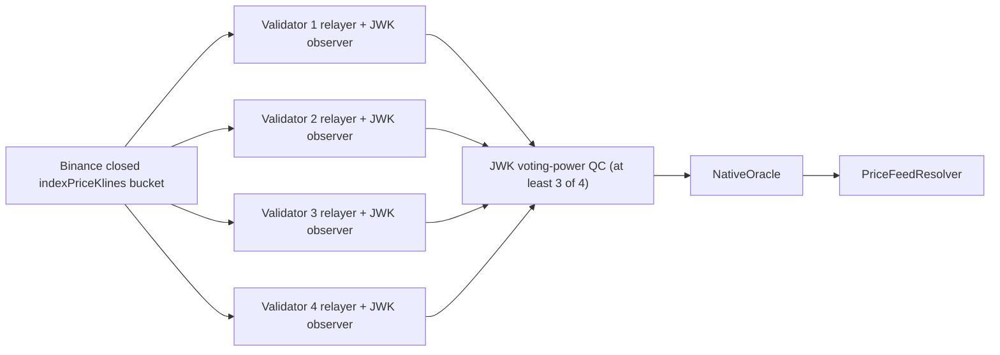

# Four-Validator Live Binance Price Feed E2E

This suite proves the complete live-data path with four equal-power Gravity
validators. It never starts or accepts the local Binance mock.



Each validator receives the same task URI and independently requests one
explicit, already-closed 1-minute bucket. The URI binds the pair, interval,
bucket start, decimals, and grace period. A four-validator equal-power set has
a JWK quorum threshold that requires matching signatures from at least three
validators.

The test asserts all of the following:

- Four validators are active and all four chains advance.
- Binance returns exactly the requested NVDAUSDT and TSLAUSDT bucket.
- The on-chain prices equal Binance's close values scaled to 8 decimals.
- Every validator logs a local certification attempt for both feed IDs.
- Every validator persists separate relayer state for both task URIs.
- JWK aggregation logs a voting-power threshold crossing for both feeds.
- All four RPC endpoints return the same `PriceFeedResolver` rounds.

## Tested Revisions

The suite is pinned to the Oracle pull-request heads used for this test:

| Repository | Revision |
| --- | --- |
| `gravity_chain_core_contracts` | `f5bd9a80794c318ea1ccdbd0fb7f15e1e83dbdad` |
| `gravity-reth` through `Cargo.lock` | `20af4ae4a2125f6232d6b2c5e7cc3f40140f2501` |
| `gravity-aptos` through `gaptos` | `10c4553b16aead745e1701db7885a39313607b26` |
| `gravity-sdk` base | `10c491bc7fe69838398971281270ce438c72e17a` |

## Run

Build the current `gravity_node` and `gravity_cli`, then run the suite
explicitly. It is excluded from the default all-suite run because it requires
public network access.

```bash
RUSTFLAGS="--cfg tokio_unstable" \
  cargo build \
    --profile quick-release \
    -p gravity_node \
    -p gravity_cli \
    --locked
```

```bash
BINANCE_PRICE_FEED_MODE=live \
BINANCE_PRICE_FEED_BASE_URL=https://testnet.binancefuture.com \
BINANCE_PRICE_FEED_LAG_MINUTES=4 \
PATH="$HOME/.foundry/bin:$PWD/target/quick-release:$PATH" \
  ./gravity_e2e/run_test.sh \
    binance_price_feed_multivalidator \
    --force-init \
    --log-cli-level=INFO
```

The official Futures testnet endpoint serves live market data and does not
require `BINANCE_API_KEY` or `BINANCE_SECRET_KEY` for this public method. It is
not a deterministic mock, but its prices are test-market prices rather than
production trading prices.

Production Binance Futures can be selected by omitting
`BINANCE_PRICE_FEED_BASE_URL`. In regions where that host returns HTTP `451`,
use the explicit testnet host above. The suite does not silently switch hosts.

To replay a specific immutable minute, set:

```bash
BINANCE_PRICE_FEED_BUCKET_START_MS=<minute-aligned Unix milliseconds>
```

The bucket must be closed and older than `graceMs` when validators poll it.

## Expected Evidence

A successful run reports four active validators and records positive NVDA and
TSLA prices. Each node's consensus log contains `Start certifying update.` for
both `gravity://3/1001` and `gravity://3/1002`; aggregation logs contain
`Peer vote aggregated.` with `threshold_exceeded=true`; and the test ends with:

```text
Four-validator live Binance QC stored roundId=... prices=...
1 passed
Suite binance_price_feed_multivalidator PASSED
```

Only an aggregation task that collects the threshold-crossing vote is expected
to log `threshold_exceeded=true`; every validator is still required to log its
own certification attempt and persist independent relayer state.

## Last Verified

The suite passed against Binance Futures testnet on 2026-07-23:

| Evidence | Observed value |
| --- | --- |
| Active validators | 4 |
| Total voting power | `8000000000000000000` |
| JWK quorum power | `5333333333333333334` |
| JWK log threshold | 3 votes (`new_total_power=6`, `threshold=6`) |
| Closed bucket | `1784802120000` (`2026-07-23T10:22:00Z`) |
| Stored round | `29746702` |
| NVDAUSDT close, 8 decimals | `21078572713` |
| TSLAUSDT close, 8 decimals | `35237693549` |
| Pytest result | `1 passed in 47.97s` |

All four validator logs contained local certification attempts for both feeds.
All four independent relayer state files reached at least nonce 1 for both
feeds, while two aggregation tasks recorded a voting-power threshold crossing.
