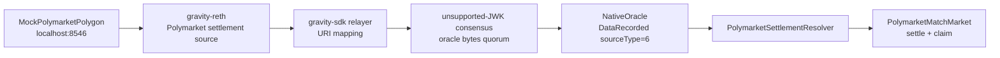

# Polymarket Mock Oracle E2E

This suite exercises the current Polymarket-like oracle path end to end without
calling Polygon or any public API. It uses a local Polygon JSON-RPC mock, lets
the Gravity relayer read a CTF `ConditionResolution` log, sends the agreed bytes
through the existing unsupported-JWK/oracle consensus path, and settles a
Gravity match market contract from the resulting oracle payload.

## What It Proves

- A Gravity oracle task can point at a Polygon-like source URI and be remapped to
  a local source in E2E via `relayer_config.json`.
- The source payload can travel through the relayer and unsupported-JWK consensus
  path into `NativeOracle`.
- Contract-side resolver logic can parse the agreed bytes, store the final
  Polymarket CTF payout vector, and expose it to a market contract.
- A match-market style contract can create a market, accept bets, lock, wait for
  oracle resolution, settle the winning outcome, and pay the winner.

## Local Topology



## How To Run

From the repository root, build the quick-release binaries first:

```bash
RUSTFLAGS="--cfg tokio_unstable" cargo build -p gravity_node --profile quick-release
RUSTFLAGS="--cfg tokio_unstable" cargo build -p gravity_cli --profile quick-release
```

Then run the suite with a Python environment that has the E2E dependencies
installed. A virtualenv is fine; a conda environment is also fine as long as its
`python3` is first in `PATH`.

```bash
PATH="$CONDA_PREFIX/bin:$HOME/.foundry/bin:$PWD/target/quick-release:$PATH" \
  ./gravity_e2e/run_test.sh polymarket_mock --force-init
```

If you are using a virtualenv instead of conda:

```bash
source gravity_e2e/.venv/bin/activate
PATH="$HOME/.foundry/bin:$PWD/target/quick-release:$PATH" \
  ./gravity_e2e/run_test.sh polymarket_mock --force-init
```

Use `--force-init` when changing the suite config or the contract branch, because
the genesis artifacts are cached under this suite.

## Expected Result

A successful run should include logs like:

```text
MockPolymarketPolygon: prepared winning_slot=<slot> payout=<vector> visible=True
Released mock Polymarket settlement: winning_slot=<slot> payout=<vector>
Polymarket match market resolved and claimed: marketId=1 winningSlot=<slot> totalPool=600000000000000000000
PASSED
Suite polymarket_mock PASSED
All suites passed!
```

The winning slot is random by default. To make the test deterministic while
debugging, set `POLYMARKET_MOCK_WINNING_SLOT` to `0`, `1`, or `2`.

## How This Maps To A Polymarket-Like Gravity Product

The current PoC keeps dynamic market discovery out of scope and focuses on the
settlement rail:

1. A market is created on Gravity with a Polymarket CTF reference
   (`conditionId`, CTF address, Polygon chain id, outcome count, and accepted
   outcome slots).
2. The Gravity oracle task watches a Polygon-like CTF `ConditionResolution` log.
   In this E2E test, `relayer_config.json` maps that URI to the local mock.
3. Validators agree on the canonical settlement bytes through the existing
   unsupported-JWK/oracle consensus path.
4. `NativeOracle` emits/stores the agreed payload for `sourceType=6`.
5. `PolymarketSettlementResolver` validates the payload against the market's
   expected CTF metadata and stores the payout vector.
6. `PolymarketMatchMarket` uses the resolver result to settle the market and
   release funds.

For a production Polymarket-like flow, the same settlement rail can be reused
while adding a request-discovery layer later:

- Static PoC: configure known CTF condition ids in genesis or governance.
- Near-term dynamic flow: create Gravity markets with explicit Polygon CTF
  references, and let a deterministic watcher discover finalized request events.
- Longer-term product flow: add provider allowlists, finality gates, request
  deadlines, and typed `Pending` / `Unknown` / `Expired` settlement states before
  validators sign any payload.

This keeps high-risk external fetch logic outside consensus-critical code until
the request watcher design is ready, while still proving that Gravity can consume
Polygon/Polymarket settlement data once a canonical source payload is available.
