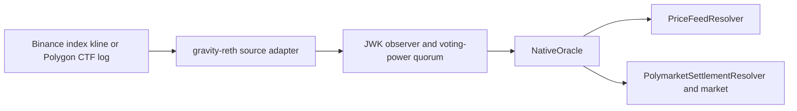

# Gravity Oracle E2E

This is the canonical runbook for the Oracle suites added by PR #758.

## Suite Matrix

| Suite | Network | Purpose | Default run |
| --- | --- | --- | --- |
| `oracle_demo` | Local mocks | Deterministic Binance plus binary Polymarket integration and frontend config | Yes |
| `polymarket_mock` | Local mock | Binary market, random winner, settlement, and payout claims | Yes |
| `polymarket_dynamic_mirror` | Local Polygon fixtures | Successive governance-created mirrors and replay protection | Yes |
| `binance_price_feed_multivalidator` | Binance public API | Four-validator independent fetch, voting-power QC, execution, and RPC replication | No |
| `polymarket_live_dynamic_mirror` | Gamma API and Polygon RPC | Four-validator dynamic mirror of a real finalized settlement | No |
| `oracle_live_soak` | Binance, Gamma, and Polygon RPC | Governance activation followed by a four-validator 24-hour liveness and consistency soak | No |

The old standalone `binance_price_feed` suite was removed because its
deterministic assertions are covered by `oracle_demo`, while its live source
and consensus assertions are covered more strongly by the four-validator
suite. Live frontend config generation moved to that suite.

`polymarket_mock` remains separate because the combined demo uses a fixed
binary outcome. The focused suite randomizes the winning slot and checks both
winner claimability and loser zero-claimability.



## Build

From the repository root:

```bash
RUSTFLAGS="--cfg tokio_unstable" \
  cargo build --profile quick-release -p gravity_node -p gravity_cli --locked
```

When using an E2E virtualenv, activate it before running a suite. Put Foundry
and the quick-release binaries on `PATH`:

```bash
export PATH="$HOME/.foundry/bin:$PWD/target/quick-release:$PATH"
```

## Deterministic Combined Gate

`oracle_demo` sends no public network traffic. It starts local Binance and
Polygon fixtures, records `sourceType=3` and `sourceType=6` through the same
Oracle consensus path, verifies two exact price rounds, and permissionlessly
finalizes one binary Gravity market from the canonical Polymarket resolver
classification. The binary market has no Gravity-local settlement deadline or
governance timeout path.

```bash
PATH="$HOME/.foundry/bin:$PWD/target/quick-release:$PATH" \
  ./gravity_e2e/run_test.sh oracle_demo --force-init
```

For the frontend:

```bash
PATH="$HOME/.foundry/bin:$PWD/target/quick-release:$PATH" \
  ./gravity_e2e/run_test.sh oracle_demo \
    --force-init \
    --keep-running \
    --demo-config-out ../gravity_price_feed_demo_web/public/demo-config.json \
    --log-cli-level=INFO
```

Stop the retained backend with:

```bash
bash cluster/stop.sh \
  --config gravity_e2e/cluster_test_cases/oracle_demo/cluster.toml
kill "$(cat gravity_e2e/cluster_test_cases/oracle_demo/artifacts/mock_binance.pid)"
```

## Focused Binary Polymarket Gate

`polymarket_mock` uses a local Polygon JSON-RPC fixture. It verifies a reviewed
CTF reference, a two-slot binary market, randomized winner mapping, market
lock and settlement, winner payout, and zero claimability for losers.

```bash
PATH="$HOME/.foundry/bin:$PWD/target/quick-release:$PATH" \
  ./gravity_e2e/run_test.sh polymarket_mock --force-init
```

Set `POLYMARKET_MOCK_WINNING_SLOT` to `0` or `1` for a reproducible
debug run. Without it, the test chooses a random valid slot.

## Dynamic Polymarket Gates

`polymarket_dynamic_mirror` proves that governance can add mirror tasks in
successive epochs. Each task activates in the next epoch, resolves through the
same JWK path, and advances only its own `(sourceType, sourceId)` progress.
Replaying an already delivered settlement emits no second `OracleDelivered`
event and does not advance the nonce.

```bash
PATH="$HOME/.foundry/bin:$PWD/target/quick-release:$PATH" \
  ./gravity_e2e/run_test.sh polymarket_dynamic_mirror --force-init
```

`polymarket_live_dynamic_mirror` queries the Gamma API for a recently closed
binary market, verifies a unique finalized Polygon CTF
`ConditionResolution`, and starts four validators. The test creates the task
through Gravity governance, waits for next-epoch activation, requires
voting-power JWK quorum evidence, compares resolver state across all four RPC
replicas, and settles and claims the Gravity binary market.

```bash
export POLYGON_RPC_URL="..."
GRAVITY_E2E_SKIP_GLOBAL_PKILL=1 \
PATH="$HOME/.foundry/bin:$PWD/target/quick-release:$PATH" \
  ./gravity_e2e/run_test.sh \
    polymarket_live_dynamic_mirror \
    --force-init \
    --log-cli-level=INFO
```

## Live Four-Validator Binance Gate

This suite is excluded from the default all-suite run because it sends public
requests. Run it only after outbound access has been approved.

Four equal-power validators observe the same closed one-minute
`indexPriceKlines` bucket. The test requires:

- all four validators active and advancing;
- all four observers to start and persist independent relayer state;
- at least three validators to certify each feed and cross the JWK threshold;
- a slower validator to safely fast-forward from the committed nonce;
- onchain prices to equal Binance close values at 8 decimals;
- all four RPC endpoints to return identical source progress and latest price.

`NativeOracle` and `PriceFeedResolver` keep fixed-size latest-only state. The
test does not depend on historical payload records or per-round price storage.

```bash
BINANCE_PRICE_FEED_MODE=live \
BINANCE_PRICE_FEED_BASE_URL=https://testnet.binancefuture.com \
BINANCE_PRICE_FEED_LAG_MINUTES=4 \
GRAVITY_E2E_SKIP_GLOBAL_PKILL=1 \
PATH="$HOME/.foundry/bin:$PWD/target/quick-release:$PATH" \
  ./gravity_e2e/run_test.sh \
    binance_price_feed_multivalidator \
    --force-init \
    --log-cli-level=INFO
```

To retain the cluster and write frontend discovery metadata, add:

```text
--keep-running
--demo-config-out ../gravity_price_feed_demo_web/public/demo-config.json
```

Stop the retained four-validator cluster with:

```bash
bash cluster/stop.sh \
  --config gravity_e2e/cluster_test_cases/binance_price_feed_multivalidator/cluster.toml
```

The public `indexPriceKlines` method does not require `BINANCE_API_KEY` or
`BINANCE_SECRET_KEY`. Testnet uses the production response shape but returns
test-market prices. The suite does not silently switch endpoints.

Set `BINANCE_PRICE_FEED_BASE_URL=https://fapi.binance.com` for production
index prices. An HTTP 451 response means the process egress is not eligible
for Binance production under its regional policy; it does not mean that the
endpoint or pair is missing. Use an approved eligible egress or the futures
testnet. A process-level proxy must bypass loopback and private networks so
validator consensus and local RPC traffic remain local.

For an immutable replay, set:

```bash
BINANCE_PRICE_FEED_BUCKET_START_MS=<minute-aligned Unix milliseconds>
```

The bucket must already be closed and older than `graceMs`.

## Live Oracle Soak

`oracle_live_soak` is the long-running operational gate. Genesis declares the
`sourceType=3` and `sourceType=6` capabilities but contains neither task. A
single governance proposal registers the continuous NVDA feed, its resolver,
and a discovered finalized Polymarket mirror. The
observers activate only after the next epoch begins.

The default 24-hour monitor requires continuous Gravity block production,
monotonic NVDA minute delivery, at least three persisted relayer cursors, exact
four-RPC state replication, immutable one-shot Polymarket settlement, and one
mid-run validator restart with catch-up. It writes an ignored JSONL heartbeat
and a final JSON summary.

```bash
export POLYGON_RPC_URL="..."
export BINANCE_PRICE_FEED_BASE_URL=https://fapi.binance.com
export ORACLE_SOAK_DURATION_SECONDS=86400
export GRAVITY_E2E_SKIP_GLOBAL_PKILL=1
export PATH="$HOME/.foundry/bin:$PWD/target/quick-release:$PATH"

./gravity_e2e/run_test.sh \
  oracle_live_soak \
  --force-init \
  --log-cli-level=INFO
```

Use `ORACLE_SOAK_DURATION_SECONDS=180`,
`ORACLE_SOAK_MIN_ADVANCES=1`, and
`ORACLE_SOAK_RESTART_AFTER_SECONDS=0` for a short validation. Full controls,
failure criteria, and evidence files are documented in the suite README.

## Pinned Revisions

| Repository | Revision |
| --- | --- |
| `gravity_chain_core_contracts` | `631b3bde8e2d6a98377e62a9b9e54ccdf0896e9d` |
| `gravity-reth` | `a5cf019429d772cd2f4964fc0705676d84464953` |
| `gravity-aptos` | `d163fa649970c7c8446dbc41a367c2d0b960cca6` |
| `gravity-sdk` | `codex/sports-score-oracle-poc` (this branch) |

Each suite's genesis file pins the contracts revision it requires.
`Cargo.lock` pins the reth and Aptos revisions.

## Last Live Verification

The following live suites were verified on 2026-07-30:

| Evidence | Value |
| --- | --- |
| Active validators | 4 |
| Total voting power | `8000000000000000000` |
| JWK quorum power | `5333333333333333334` |
| Binance testnet stored round | `29756744` |
| Binance testnet NVDAUSDT / TSLAUSDT | `19199999338` / `30046300000` |
| Binance testnet pytest | `1 passed in 44.81s` |
| Live Polymarket mirror ID | `3029713` |
| Live Polymarket source block | `91132830` |
| Live Polymarket activation epoch | `3` |
| Live Polymarket pytest | `1 passed in 70.79s` |

The same Binance suite against `https://fapi.binance.com` could not observe a
round from this environment because the API returned HTTP 451 under Binance's
regional eligibility policy. All four Gravity validators remained active and
continued producing blocks; this is an egress limitation, not a consensus or
contract failure.

## Scope

These suites prove configured task execution and contract consumption. They do
not implement generic intra-epoch request discovery or automatic mirroring of
arbitrary Polymarket UI markets.

Production Polymarket mirrors need a reviewed manifest containing the rules,
condition and question IDs, CTF address, outcome labels, slot mapping, source
block range, and metadata hashes. Dynamic discovery additionally needs
finality gates, watermarks, request-expiry policies, and typed pending or
expired states. Request expiry is a watcher lifecycle concern; it must not
create a Gravity-local fallback result for a strict Polymarket mirror.

Use `--force-init` after changing genesis configuration or a pinned contracts
revision. Otherwise cached artifacts may be reused.

The runner normally performs a global `gravity_node` cleanup. Set
`GRAVITY_E2E_SKIP_GLOBAL_PKILL=1` when an unrelated local Gravity node must
remain running; the suite still stops its own configured cluster.
