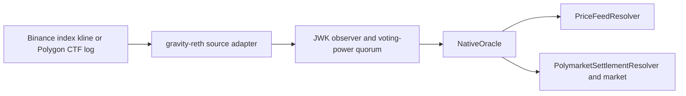

# Gravity Oracle E2E

This is the canonical runbook for the Oracle suites added by PR #758.

## Suite Matrix

| Suite | Network | Purpose | Default run |
| --- | --- | --- | --- |
| `oracle_demo` | Local mocks | Deterministic Binance plus binary Polymarket integration and frontend config | Yes |
| `polymarket_mock` | Local mock | Three-outcome sports market, random winner, settlement, and payout claim | Yes |
| `binance_price_feed_multivalidator` | Binance public API | Four-validator independent fetch, voting-power QC, execution, and RPC replication | No |

The old standalone `binance_price_feed` suite was removed because its
deterministic assertions are covered by `oracle_demo`, while its live source
and consensus assertions are covered more strongly by the four-validator
suite. Live frontend config generation moved to that suite.

`polymarket_mock` remains separate because the combined demo only covers a
fixed binary outcome. It does not cover a three-outcome match, random outcome
mapping, winner claim, or loser zero-claim checks.



## Build

From the repository root:

```bash
RUSTFLAGS="--cfg tokio_unstable" \
  cargo build --profile quick-release -p gravity_node -p gravity_cli --locked
```

When using an E2E virtualenv, activate it before running a suite. Put Foundry
and the quick-release binaries on `PATH`:

```bash
export PATH="$HOME/.foundry/bin:$PWD/target/quick-release:$PATH"
```

## Deterministic Combined Gate

`oracle_demo` sends no public network traffic. It starts local Binance and
Polygon fixtures, records `sourceType=3` and `sourceType=6` through the same
Oracle consensus path, verifies two exact price rounds, and permissionlessly
finalizes one binary Gravity market from the canonical Polymarket resolver
classification. The binary market has no Gravity-local settlement deadline or
governance timeout path.

```bash
PATH="$HOME/.foundry/bin:$PWD/target/quick-release:$PATH" \
  ./gravity_e2e/run_test.sh oracle_demo --force-init
```

For the frontend:

```bash
PATH="$HOME/.foundry/bin:$PWD/target/quick-release:$PATH" \
  ./gravity_e2e/run_test.sh oracle_demo \
    --force-init \
    --keep-running \
    --demo-config-out ../gravity_price_feed_demo_web/public/demo-config.json \
    --log-cli-level=INFO
```

Stop the retained backend with:

```bash
bash cluster/stop.sh \
  --config gravity_e2e/cluster_test_cases/oracle_demo/cluster.toml
kill "$(cat gravity_e2e/cluster_test_cases/oracle_demo/artifacts/mock_binance.pid)"
```

## Focused Three-Outcome Polymarket Gate

`polymarket_mock` uses a local Polygon JSON-RPC fixture. It verifies a reviewed
CTF reference, a three-slot match market, randomized winner mapping, market
lock and settlement, winner payout, and zero claimability for losers.

```bash
PATH="$HOME/.foundry/bin:$PWD/target/quick-release:$PATH" \
  ./gravity_e2e/run_test.sh polymarket_mock --force-init
```

Set `POLYMARKET_MOCK_WINNING_SLOT` to `0`, `1`, or `2` for a reproducible
debug run. Without it, the test chooses a random valid slot.

## Live Four-Validator Binance Gate

This suite is excluded from the default all-suite run because it sends public
requests. Run it only after outbound access has been approved.

Each of four equal-power validators independently requests the same closed
one-minute `indexPriceKlines` bucket. The test requires:

- all four validators active and advancing;
- every validator to certify both feed issuers and persist independent state;
- at least three matching equal-power votes to cross the JWK threshold;
- onchain prices to equal Binance close values at 8 decimals;
- all four RPC endpoints to return identical resolver rounds.

```bash
BINANCE_PRICE_FEED_MODE=live \
BINANCE_PRICE_FEED_BASE_URL=https://testnet.binancefuture.com \
BINANCE_PRICE_FEED_LAG_MINUTES=4 \
PATH="$HOME/.foundry/bin:$PWD/target/quick-release:$PATH" \
  ./gravity_e2e/run_test.sh \
    binance_price_feed_multivalidator \
    --force-init \
    --log-cli-level=INFO
```

To retain the cluster and write frontend discovery metadata, add:

```text
--keep-running
--demo-config-out ../gravity_price_feed_demo_web/public/demo-config.json
```

Stop the retained four-validator cluster with:

```bash
bash cluster/stop.sh \
  --config gravity_e2e/cluster_test_cases/binance_price_feed_multivalidator/cluster.toml
```

The public `indexPriceKlines` method does not require `BINANCE_API_KEY` or
`BINANCE_SECRET_KEY`. Testnet uses the production response shape but returns
test-market prices. The suite does not silently switch endpoints.

For an immutable replay, set:

```bash
BINANCE_PRICE_FEED_BUCKET_START_MS=<minute-aligned Unix milliseconds>
```

The bucket must already be closed and older than `graceMs`.

## Pinned Revisions

| Repository | Revision |
| --- | --- |
| `gravity_chain_core_contracts` (`oracle_demo`) | `0f769b892387989ae3dad84bf5c8db381d1865f0` |
| `gravity_chain_core_contracts` (other Oracle suites) | `f5bd9a80794c318ea1ccdbd0fb7f15e1e83dbdad` |
| `gravity-reth` | `20af4ae4a2125f6232d6b2c5e7cc3f40140f2501` |
| `gravity-aptos` | `10c4553b16aead745e1701db7885a39313607b26` |
| `gravity-sdk` base | `10c491bc7fe69838398971281270ce438c72e17a` |

Each suite's genesis file pins the contracts revision it requires.
`oracle_demo` uses the strict binary Polymarket finality ABI; the focused
three-outcome and Binance suites remain on their existing compatible contract
revision. `Cargo.lock` pins the reth and Aptos revisions.

## Last Live Verification

The four-validator suite passed against Binance Futures testnet on 2026-07-23:

| Evidence | Value |
| --- | --- |
| Active validators | 4 |
| Total voting power | `8000000000000000000` |
| JWK quorum power | `5333333333333333334` |
| Log threshold | 3 votes (`new_total_power=6`, `threshold=6`) |
| Closed bucket | `1784802120000` (`2026-07-23T10:22:00Z`) |
| Stored round | `29746702` |
| NVDAUSDT, 8 decimals | `21078572713` |
| TSLAUSDT, 8 decimals | `35237693549` |
| Pytest | `1 passed in 47.97s` |

## Scope

These suites prove configured task execution and contract consumption. They do
not implement generic intra-epoch request discovery or automatic mirroring of
arbitrary Polymarket UI markets.

Production Polymarket mirrors need a reviewed manifest containing the rules,
condition and question IDs, CTF address, outcome labels, slot mapping, source
block range, and metadata hashes. Dynamic discovery additionally needs
finality gates, watermarks, request-expiry policies, and typed pending or
expired states. Request expiry is a watcher lifecycle concern; it must not
create a Gravity-local fallback result for a strict Polymarket mirror.

Use `--force-init` after changing genesis configuration or a pinned contracts
revision. Otherwise cached artifacts may be reused.
