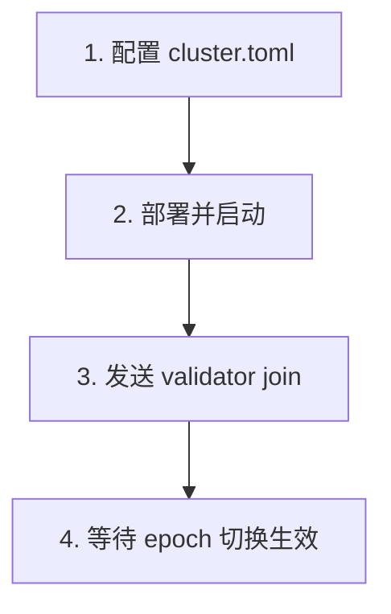

# Gravity 验证器节点加入指南

本文档介绍如何将一个新的验证器节点加入到已运行的 Gravity 网络中。

## 前置条件

1. **已运行的 Gravity 网络**：至少有 3 个 Genesis 验证器节点正在运行
2. **新节点服务器**：准备好加入网络的服务器
3. **编译二进制文件**：
   ```bash
   RUSTFLAGS="--cfg tokio_unstable" cargo build --profile quick-release -p gravity_node -p gravity_cli
   ```
   编译后位于 `target/quick-release/gravity_node` 和 `target/quick-release/gravity_cli`
4. **网络连通性**：新节点可以访问现有节点的 P2P 端口
5. **资金账户**：用于质押的 EVM 账户（需要 ETH 余额用于 gas 和质押）

---

## 步骤概览



> [!TIP]
> 启动节点后即可发送 **validator join** 交易，无需等待同步完成。

---

## 详细步骤

### 1. 获取 Genesis 文件

从现有网络节点获取：
```bash
rsync existing-node:/data/gravity/genesis.json ./
rsync existing-node:/data/gravity/waypoint.txt ./
```

### 2. 配置 cluster.toml

```toml
# Gravity Cluster Configuration

[cluster]
name = "my-validator"
base_dir = "/data/gravity"                    # 节点数据目录

[build]
binary_path = "./gravity_node"                # 二进制文件路径

[genesis_source]
genesis_path = "./genesis.json"
waypoint_path = "./waypoint.txt"

[[nodes]]
id = "my-node"
role = "vfn"                                  # VFN 角色
host = "YOUR_PUBLIC_IP"                       # 你的节点公网 IP
p2p_port = 6180                               # P2P 端口（共识层）
vfn_port = 6190                               # VFN 端口（全节点网络）
rpc_port = 8545                               # JSON-RPC 端口
metrics_port = 9001                           # Metrics 端口
inspection_port = 10000                       # Inspection API 端口
https_port = 1024                             # HTTPS 端口
authrpc_port = 8551                           # Auth RPC 端口
reth_p2p_port = 12024                         # Reth P2P 端口
```

### 3. 初始化并部署

```bash
cd gravity-sdk/cluster
make init      # 生成 identity
make deploy    # 生成配置
```

### 4. 拷贝到部署机器

```bash
rsync -avz /data/gravity/my-node/ deploy-machine:/data/gravity/my-node/
```

### 5. 启动节点

在部署机器上：
```bash
cd /data/gravity/my-node
./start.sh
```

---

### 6. 发送 Validator Join 交易

启动节点后即可发送 join 交易：

```bash
# 读取密钥
CONSENSUS_PUB_KEY=$(grep consensus_public_key /data/gravity/my-node/config/identity.yaml | awk '{print $2}')
NETWORK_PUB_KEY=$(grep network_public_key /data/gravity/my-node/config/identity.yaml | awk '{print $2}')

./gravity_cli validator join \
  --rpc-url http://MAINNET_RPC_IP:8545 \
  --private-key 0x<YOUR_PRIVATE_KEY> \
  --stake-amount <STAKE_AMOUNT> \
  --consensus-public-key "$CONSENSUS_PUB_KEY" \
  --validator-network-address "/ip4/YOUR_PUBLIC_IP/tcp/6180/noise-ik/$NETWORK_PUB_KEY/handshake/0" \
  --fullnode-network-address "/ip4/YOUR_PUBLIC_IP/tcp/6190/noise-ik/$NETWORK_PUB_KEY/handshake/0" \
  --moniker "<MY_VALIDATOR>"
```

#### 验证状态

```bash
./gravity_cli validator list --rpc-url http://MAINNET_RPC_IP:8545
```

新 validator 会出现在 `pending_active` 列表，下一个 epoch 后生效。

---

## 验证器退出

```bash
./gravity_cli validator leave \
  --rpc-url http://MAINNET_RPC_IP:8545 \
  --private-key <YOUR_PRIVATE_KEY> \
  --stake-pool <STAKE_POOL_ADDRESS>
```

---

## 故障排查

| 问题 | 解决方案 |
|------|----------|
| 节点无法同步 | 检查 genesis.json 和 waypoint.txt 是否正确 |
| validator join 失败 | 确保账户有足够 ETH，质押金额满足 minimum_stake |
| 在 pending_active 但不生效 | 等待下一个 epoch（查看 epoch_interval_micros 配置） |

---

## 参考

- 测试用例：`gravity_e2e/cluster_test_cases/fuzzy_cluster/test_epoch_switch.py`
- 集群脚本：`gravity-sdk/cluster/`

